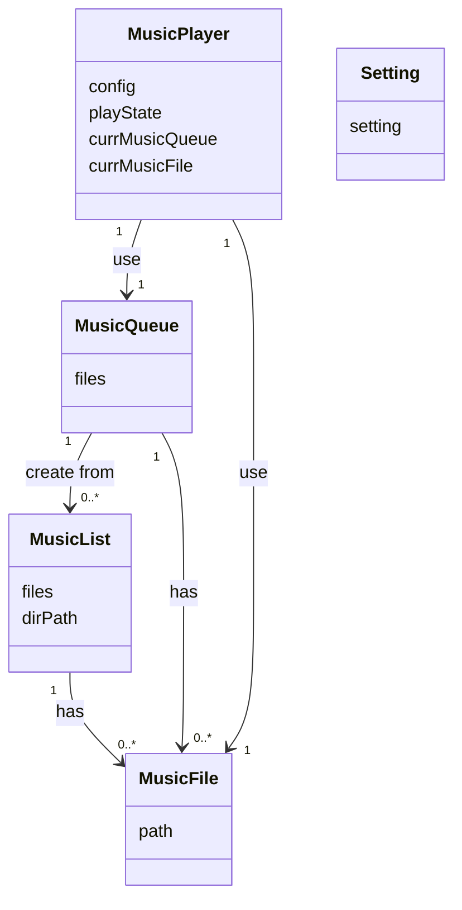

# 需求

实现一个本地音乐的播放器。

## 界面

- 播放界面 -> 播放队列
- 修改播放列表界面，扫描所有歌曲
- 设置界面
- 播放时长和次数统计界面
- 搜索界面

## domain

```mermaid
classDiagram
class MusicFile {
	path
}

class MusicList {
	files
	dirPath
}

class MusicQueue {
	files
}

class MusicPlayer {
	config
	playState
	currMusicQueue
	currMusicFile
}

class Setting {
	setting
}
MusicList "1" --> "0..*" MusicFile : has
MusicQueue "1" --> "0..*" MusicFile : has
MusicQueue "1" --> "0..*" MusicList : create from
MusicPlayer "1" --> "1" MusicQueue : use
MusicPlayer "1" --> "1" MusicFile : use
```
