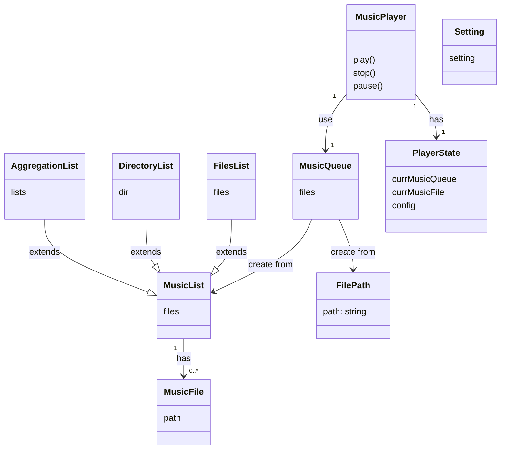
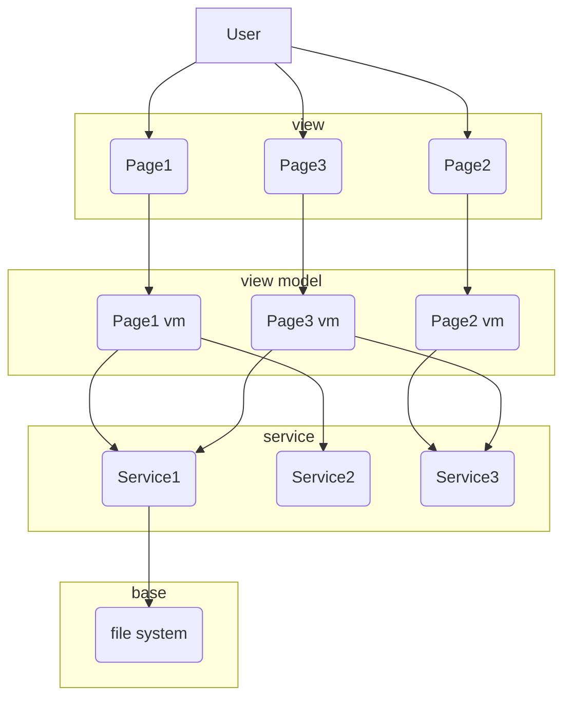
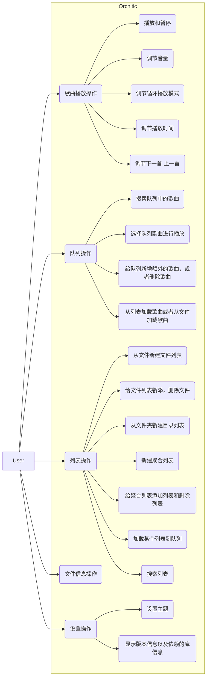

# 需求

实现一个本地音乐的播放器。

## TODO

- 国际化
- 增加log输出
- 显示歌曲更多信息
- 列表平滑滚动
- 更多设置
- 更多工具
- 弹窗背景模糊
- 队列中已有歌曲但是路径不存在或者无法播放
- 歌词显示
- 音频显示动效

## 界面

- 播放界面 -> 播放队列
- 修改播放列表界面，扫描所有歌曲
- 设置界面
- 播放时长和次数统计界面
- 搜索界面
- 设置歌曲文件信息

## domain

## Architecture

## Usercase

